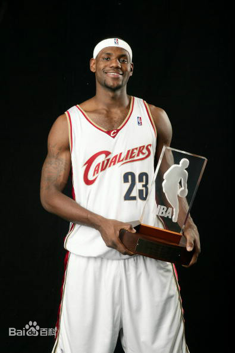

## 勒布朗·詹姆斯

>勒布朗·詹姆斯（LeBron James），全名*勒布朗·雷蒙·詹姆斯（LeBron Raymone James）*，1984年12月30日出生于美国俄亥俄州阿克伦，美国职业篮球运动员，司职小前锋，绰号“***小皇帝***”（King James），效力于NBA洛杉矶湖人队。


#### 个人经历
* 詹姆斯在2003年NBA选秀中于首轮第1顺位被克利夫兰骑士队选中，在2009年与2010年蝉联NBA常规赛最有价值球员 **（MVP）**。
* 2010年，詹姆斯转会至迈阿密热火队。
* 2012年，詹姆斯得到NBA个人生涯的第3座常规赛MVP，第1个总冠军和总决赛MVP，并代表美国男篮获得了伦敦奥运会金牌，追平了迈克尔·乔丹在1992年所创的纪录。
* 2013年，詹姆斯夺得第4个常规赛MVP、第2个NBA总冠军和第2个总决赛MVP，实现两连冠。
* 2014年，詹姆斯回归骑士。
* 2016年，詹姆斯带领骑士逆转战胜卫冕冠军勇士夺得队史首个总冠军和个人第3个总决赛MVP。
* 2018年7月10日，詹姆斯正式与湖人签下4年1.53亿美元的合同。
* 2019-20赛季，詹姆斯当选NBA助攻王，夺得第4次总冠军以及个人第4个总决赛MVP。

#### 个人荣誉
|荣誉名称|次数/备注|
|----|----|
|NBA总冠军|4次（2012年、2013年、2016年、2020年）|
|NBA东部联盟冠军|9次（2007年、2011年~2018年）| 
|NBA西部联盟冠军|1次（2020年）|
|美国职业篮球联赛最有价值球员奖|4次（2009年、2010年、2012年、2013年）|
|比尔·拉塞尔NBA总决赛最有价值球员奖|4次（2012年、2013年、2016年、2020年）| 
|美国职业篮球联赛全明星赛最有价值球员奖|3次（2006年、2008年、2018年）|
|NBA全明星|17次（2005年~2021年） |

#### 获奖记录
1.  2021-2-24 劳伦斯世界体育奖年度最佳男运动员奖   （提名） 
2. 2020 KCA尼克儿童选择奖得时代影响力奖和年度最受欢迎男运动员奖 （获奖）  
3.  2019   福布斯100名人榜排名第17位   （提名）    


[返回](./README.md)

---
~~阿巴阿巴~~
```
read -p "change the permission[m]   " ch2
if [ "$ch2" = "m" ]
        then
        chmod u+x sum
fi